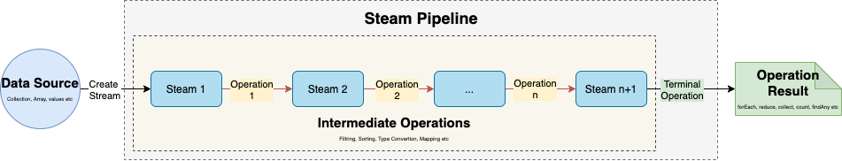

The hello-world project

<div align="center">
    
</div>


## Project structure
```
.
├── java-8-stream
│   ├── pom.xml
│   ...
├── pom.xml
|
└── README.md
```

## Start project

```shell
$ mvn clean package
$ java -jar java-8-stream/target/java-8-stream-0.0.1-SNAPSHOT.jar
```

## Contribute

## Reference

- https://topdev.vn/blog/tuot-tuon-tuot-ve-java-8-nhung-thay-doi-lon/
- https://topdev.vn/blog/nhung-ma-xau-ma-java-8-co-the-khu/
- https://gpcoder.com/3923-gioi-thieu-ve-stream-api-trong-java-8/
- https://winterbe.com/posts/2014/07/31/java8-stream-tutorial-examples/
- https://www.baeldung.com/java-8-streams